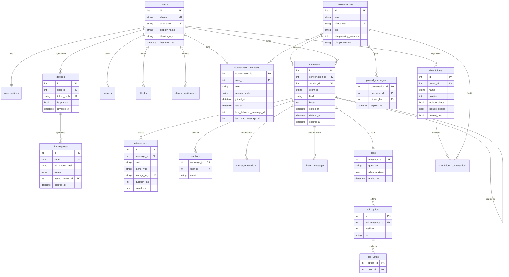

# Signal Clone

A Signal-style secure messenger: the look and flow of **Signal Desktop** on wide screens and **Signal Android** on
phones, with real-time 1:1 and group chat, delivery/read ticks, typing indicators, groups with admin controls, and a set
of Signal features beyond the brief (message requests, safety numbers, edit/delete, pinned messages, polls, chat
folders, voice notes and device linking).

- **Live demo:** https://signal-clone-asm20-web.onrender.com (API: https://signal-clone-asm20-api.onrender.com/api/health)
- **Repository:** https://github.com/A-SM20/Signal-Clone — `frontend/` (Next.js) and `backend/` (FastAPI)

> The API runs on Render's free tier. The first request after a cold start can take ~1 minute; the app shows a
> "Connecting…" screen meanwhile. Chats are stored in a free Neon Postgres database, so they survive restarts
> and redeploys.

---

## Try it

Sign in by typing a demo account's phone number (country code `+1`, then e.g. `555 010 0001`) and the **default
PIN `123456`**. No SMS is sent. New numbers work too: they create a fresh account, and during profile setup you can
choose your own PIN, which then replaces `123456` for that account.

| Name | Phone | What to look at |
|---|---|---|
| Alice Chen | +1 555-010-0001 | Main demo account: unread chats, a message request, folders "Unread" and "Work" |
| Bob Martinez | +1 555-010-0002 | Alice's hiking buddy: edited + deleted messages, a voice note, a verified safety number |
| Priya Sharma | +1 555-010-0003 | Group member in Weekend Hike and Project Phoenix |
| Daniel Kim | +1 555-010-0004 | Admin of Project Phoenix (pinned kickoff message); Alice's chat shows "safety number changed" |
| Emma Wilson | +1 555-010-0005 | Disappearing-messages chat with Alice; admin of Family |
| Lucas Silva | +1 555-010-0006 | Weekend Hike member (voted in the trail poll) |
| Mei Tanaka | +1 555-010-0007 | Family and Project Phoenix member |
| Jordan Blake | +1 555-010-0008 | A stranger whose chat reaches Alice as a **message request** |

**Two-browser walkthrough** (use two browsers, or one normal + one private window):

1. Window A: sign in as **Alice**. Window B: sign in as **Bob**.
2. In A open *Bob Martinez* and send a message — it appears in B instantly. A's ticks go ✓ (sent) → ✓✓ (delivered)
   → filled ✓✓ (read) once B has the chat open.
3. Start typing in B — A shows the typing bubble. Close B — A's header switches from "Online" to "Last seen …".
4. Hover a message (or long-press on mobile) to react, reply, edit, delete, pin or see delivery info.
5. Press **↑** in an empty composer to edit your last message; **Ctrl/⌘ /** lists all keyboard shortcuts.

---

## Features

### Must-haves (from the brief)

- **Auth & profile:** phone number + PIN (default `123456`, replaceable with your own; no SMS), profile name/about/photo, username, log out, delete account.
- **Chat list:** recent-first with pinned chats on top, search (chats, contacts, messages), add contact by phone or
  username, unread badges, last-message preview (sender name in groups), typing shown in the row, online/last-seen.
- **1:1 messaging:** real-time over WebSockets, timestamps, sending → sent → delivered → read ticks, typing indicator,
  persistence, optimistic sending with automatic retry and a "Not sent, click to retry" state.
- **Groups:** create, rename, description, photo, add/remove members, make/remove admin, leave; system messages for
  every change; group read ticks only when everyone has read (as in Signal).
- **Signal look & feel:** nav rail + chat list + conversation (desktop), bottom tabs and full-screen chats (mobile),
  Signal bubbles and grouping, date separators, modals, bottom toasts, settings (Profile, Account, Linked devices,
  Appearance, Chats, Notifications, Privacy, Help) whose privacy toggles really change behaviour.
- **Placeholders:** voice/video calls and Stories show "coming soon" screens; end-to-end encryption is simulated.

### Bonus (from the brief)

Image albums and file attachments with upload progress, emoji reactions, quoted replies, disappearing messages
(per-chat timer, server sweeper), light/dark themes and chat colours, fully responsive layout, keyboard shortcuts,
touch gestures (long-press menu, swipe to reply), desktop notifications.

### Beyond the brief

| Feature | What it does |
|---|---|
| Message requests | Chats from non-contacts wait behind Accept / Block / Delete; no read receipts or typing leak until accepted. Blocking is silent. |
| Safety numbers | Signal's numeric-fingerprint algorithm (60 digits + QR); mark as verified; "safety number changed" notice. |
| Edit & delete | Edit within 24 h with full edit history; delete for everyone (24 h) or delete for me. |
| Pinned messages | Up to 3 per chat for 24 h / 7 d / 30 d / forever; pinned bar cycles through them; groups can restrict pinning to admins. |
| Polls | Single or multiple choice, live tallies, non-anonymous "View votes", creator can end the poll. |
| Chat folders | Tabs above the chat list; suggested Unread / 1:1 / Groups folders or custom ones (chat types, specific chats, unread-only); drag to reorder. |
| Voice notes | Record in the browser, waveform bubble with scrubbing and 1× / 1.5× / 2× playback. |
| Device linking | A new browser shows a QR + pairing code; a signed-in device scans or types it; linked devices can be unlinked remotely. |

---

## Tech stack

| Layer | Choice |
|---|---|
| Frontend | Next.js 16 (static export) · React 19 · TypeScript 5 · Tailwind CSS 4 · TanStack Query 5 · Zustand 5 · lucide icons · qrcode.react |
| Backend | Python 3.11 · FastAPI 0.142 · SQLAlchemy 2.1 (async) + aiosqlite · Pydantic 2 · Pillow (seed media, image metadata) |
| Database | PostgreSQL in production (Neon free tier, asyncpg) · SQLite locally (WAL mode, foreign keys on) — same code via SQLAlchemy |
| Real-time | Native WebSockets (one per device) |
| Tests | pytest (205 tests) · Vitest (99 tests) · Playwright (two-user end-to-end) |
| Hosting | Render (static site + free web service) · GitHub Actions (CI + keep-alive) |

---

## Architecture

```
Browser (Next.js static export, TypeScript)
 ├─ REST over HTTPS  ── all state changes + reads
 └─ WebSocket (one per device) ── server push + ephemeral signals (typing, receipts, heartbeat)
                                  ▼
             FastAPI service (single uvicorn worker)
   api (routers) → services (business rules) → repositories → SQLAlchemy async (aiosqlite)
   realtime hub: in-memory map user_id → {device_id → WebSocket}
   background tasks: disappearing-message sweeper (5 s), pin-expiry sweeper (60 s)
                                  ▼
          Postgres (Neon) in production, SQLite file locally — seeded when empty
          (file bytes live in the database too: the host's disk is wiped on restart)
GitHub Actions (every 10 min) ──GET /api/health──▶ keeps the free API instance awake
```

- **Frontend:** TanStack Query's cache is the single source of truth for server data; WebSocket events are applied
  straight into that cache (`lib/realtime/applyEvent.ts`). Zustand holds client state: session, UI selection, the
  outbox of unsent messages, typing state, reply/edit drafts. Static export means no SSR: the open chat lives in
  `?c=<id>`, and routes are `/`, `/onboarding/` and `/link/`.
- **Backend:** routers only parse input and check membership; business rules live in `app/services/`; queries that
  encode visibility rules (join/leave window, silent blocks, delete-for-me) live in `app/repositories/`.
- **Auth:** each sign-in is a *device*. A random 32-byte token is sent as `Authorization: Bearer …` and kept in
  `localStorage` (the two Render subdomains are different sites, so cookies are unreliable). Only `sha256(token)` is
  stored. Unlinking a device closes its socket with code 4403 and the client returns to onboarding.

### How one message flows

```
Alice's browser                     API                                   Bob's browser
───────────────                     ───                                   ─────────────
optimistic bubble 🕓 (outbox)
POST /conversations/7/messages ───▶ insert (UNIQUE sender_id+client_id
  {client_id: uuid, body}            makes retries idempotent)
                                    hub.send(members, message.created) ─▶ bubble appears
✓ sent ◀── 201 MessageOut                                                 ws: receipt {delivered, up_to}
                                    advance Bob's delivered cursor
✓✓ delivered ◀── receipt.updated ◀─ hub.send(Alice, receipt.updated)
                                                                          chat open + visible + at bottom
                                    advance Bob's read cursor          ◀─ ws: receipt {read, up_to}
filled ✓✓ read ◀── receipt.updated
```

### WebSocket protocol (`/api/ws`)

First frame must be `{"type":"auth","token":"…"}` within 5 s (else close 4401). Every frame is `{type, data, ts}`.
The client pings every 25 s; silent sockets are dropped after 60 s; reconnects back off 1 s → 30 s.

| Direction | Event | Payload |
|---|---|---|
| client → server | `typing` | `{conversation_id, state: start\|stop}` |
| client → server | `receipt` | `{conversation_id, kind: delivered\|read, up_to_message_id}` |
| client → server | `ping` | `{}` → `pong` |
| server → client | `message.created` / `message.updated` | full message (new / edited / deleted for everyone) |
| server → client | `message.removed` | `{conversation_id, message_ids}` (disappeared, or deleted for me on my other devices) |
| server → client | `reaction.updated` | `{conversation_id, message_id, reactions}` |
| server → client | `poll.updated` | `{conversation_id, message_id, options[{id, text, vote_count, voter_ids}], ended_at}` |
| server → client | `pin.updated` | `{conversation_id, pins}` |
| server → client | `receipt.updated` | `{conversation_id, user_id, delivered_up_to, read_up_to}` |
| server → client | `typing` | `{conversation_id, user_id, state}` |
| server → client | `presence` | `{user_id, online, last_seen_at}` |
| server → client | `conversation.updated` / `conversation.removed` | conversation (per-viewer) / `{conversation_id}` |
| server → client | `device.revoked` | `{}` |

---

## Database schema

20 tables. Every message, reaction, vote and pin hangs off `conversations`; per-member state (role, request state,
receipt cursors, mute/archive/pin) lives on `conversation_members`.



Key decisions:

1. **Receipt cursors, not per-message receipt rows.** Message ids only grow, so each member's progress is two numbers
   (`last_delivered_message_id`, `last_read_message_id`) that only move forward. Unread counts, tick status and the
   per-member "Message details" view are all derived from them. Turning read receipts off hides your cursor from others
   and theirs from you (Signal's reciprocity rule).
2. **Idempotent sends:** `UNIQUE(sender_id, client_id)`; a retried POST returns the stored message (200) instead of a
   duplicate, so the outbox can retry safely.
3. **One direct chat per pair:** `direct_key = "min:max"` is unique; Note to Self is `"id:id"`.
4. **Visibility windows:** members keep their row after leaving (`left_at`) and see history only between `joined_at`
   and `left_at`. Silent blocks and delete-for-me are query filters, applied to lists, search, unread counts and previews.
5. **Message requests** are a per-member `request_state`; while pending, that member's receipts and typing are not
   relayed, and they can't reply until they accept.
6. **Files** (uploads, avatars, seed media) are stored in the database under random keys — Render's disk is wiped
   on every restart, the database isn't — and served through short-lived HMAC-signed URLs with byte-range support
   (so voice notes can be seeked).

---

## API overview (REST, prefix `/api`)

Interactive docs: `<api-url>/docs`. All endpoints except auth, health, link-request creation/polling and signed file
downloads need `Authorization: Bearer <token>`. Errors are `{"error": {"code", "message"}}`.

| Area | Endpoints |
|---|---|
| Auth | `POST /auth/request-otp`, `POST /auth/verify-otp`, `POST /auth/logout` |
| Me | `GET/PATCH /me`, `POST /me/avatar`, `GET/PATCH /me/settings` |
| Devices | `GET /devices`, `DELETE /devices/{id}`, `POST /link-requests`, `GET /link-requests/{id}` (`X-Poll-Secret`), `POST /link-requests/approve` |
| People | `GET /users/lookup?q=`, `GET/POST /contacts`, `DELETE /contacts/{id}`, `GET /blocks`, `POST/DELETE /blocks/{id}` |
| Safety numbers | `GET /users/{id}/safety-number`, `POST/DELETE /users/{id}/verification` |
| Conversations | `GET /conversations`, `POST /conversations/direct`, `POST /conversations/groups`, `GET/PATCH /conversations/{id}`, `PATCH /conversations/{id}/me`, `POST /conversations/{id}/members`, `PATCH/DELETE /conversations/{id}/members/{user_id}`, `POST /conversations/{id}/avatar`, `POST /conversations/{id}/request` |
| Messages | `GET/POST /conversations/{id}/messages`, `PATCH/DELETE /messages/{id}`, `GET /messages/{id}/revisions`, `GET /messages/{id}/details`, `PUT/DELETE /messages/{id}/reaction`, `POST/DELETE /messages/{id}/pin` |
| Polls | `PUT /polls/{message_id}/votes`, `POST /polls/{message_id}/end` |
| Folders | `GET/POST /folders`, `PATCH/DELETE /folders/{id}`, `PUT /folders/order` |
| Files & search | `POST /attachments`, `GET /files/{key}?exp&sig`, `GET /search?q=` |
| Health | `GET /health` |

---

## Run it locally

Requirements: Python 3.11+, Node.js 22+.

```bash
# Backend (http://localhost:8000)
cd backend
python -m venv .venv
.venv/Scripts/activate        # Windows;  source .venv/bin/activate on macOS/Linux
pip install -r requirements.txt -r requirements-dev.txt
uvicorn app.main:app --reload --port 8000
```

```bash
# Frontend (http://localhost:3000), in a second terminal
cd frontend
npm ci
npm run dev
```

The API seeds the demo data on first start (empty database). To reset it, stop the API and run
`python -m app.seed --reset` from `backend/`.

**Environment variables**

| Variable | Where | Default | Purpose |
|---|---|---|---|
| `DATABASE_URL` | backend | unset | Postgres connection string (e.g. Neon's `postgresql://…?sslmode=require`). Unset → SQLite |
| `DATABASE_PATH` | backend | `./data/signal.db` | SQLite file, used when `DATABASE_URL` is unset |
| `CORS_ORIGINS` | backend | `http://localhost:3000,http://127.0.0.1:3000` | Allowed frontend origins (comma-separated) |
| `SIGNING_SECRET` | backend | dev value | HMAC key for file URLs — set a random value in production |
| `MOCK_OTP` | backend | `123456` | The default PIN (for every account that hasn't set its own) |
| `SEED_ON_EMPTY` | backend | `true` | Seed demo data when the users table is empty |
| `NEXT_PUBLIC_API_URL` | frontend (build time) | `http://localhost:8000` | API base URL |

**Tests**

```bash
cd backend && python -m pytest -q          # 205 API, realtime and seed tests
cd frontend && npm run typecheck && npx vitest run && npm run build
cd frontend && npx playwright test         # starts its own API + web on ports 8100/3100 and runs a two-user chat
```

`scripts/test-all.sh` runs the backend and frontend unit suites together. `npm run gen:api` regenerates the frontend's
TypeScript API types from the backend's OpenAPI schema. To run the backend suite against Postgres, point
`TEST_DATABASE_URL` at a disposable database (CI does this with a `postgres:16` service).

---

## Deployment (Render)

`render.yaml` is a Render Blueprint with two free services:

- **API** — Python web service, `rootDir: backend`, start `uvicorn app.main:app --host 0.0.0.0 --port $PORT`,
  health check `/api/health`, `SIGNING_SECRET` generated by Render, `DATABASE_URL` entered by you (see below).
- **Web** — static site, `rootDir: frontend`, build `npm ci && npm run build`, publishes `out/`,
  `NEXT_PUBLIC_API_URL` pointing at the API.

Steps:

1. **Database:** create a free project at [neon.tech](https://neon.tech) and copy its connection string
   (`postgresql://…@….neon.tech/neondb?sslmode=require`).
2. Render → **New → Blueprint** → pick the repo → Apply. When asked for `DATABASE_URL`, paste the Neon string
   (or add it later under the API service's **Environment**). The first start creates the tables and seeds the demo data.
3. If a service name is taken, rename it in `render.yaml` and update `CORS_ORIGINS` / `NEXT_PUBLIC_API_URL` to match.

To reset the hosted demo data, run `DATABASE_URL=<neon url> python -m app.seed --reset` from `backend/`.

**Keep-alive:** free web services sleep after 15 idle minutes. `.github/workflows/keep-render-alive.yml` pings
`/api/health` every 10 minutes (set the repository variable `API_URL` to your API's URL). GitHub may delay or skip
scheduled runs at busy times, so an occasional cold start is still possible. Note that this uses Render free-tier hours
around the clock.

---

## Android app

The same frontend is packaged as an Android app with [Capacitor](https://capacitorjs.com) (`frontend/android/`). It
bundles the static build and talks to the deployed API, so it behaves exactly like the website, with a few native
touches: the hardware back button closes panels, then the open chat, then exits; microphone and camera permissions are
requested the first time you record a voice note or scan a QR code. Desktop-style notifications aren't available
inside the app.

**Install:** download `SignalClone.apk` from the repository's latest
[Release](../../releases/latest) (or from a run of the *Android APK* workflow under Actions), open it on your phone,
and allow "Install unknown apps" when Android asks. The APK is debug-signed: fine for a demo, not for the Play Store.
Sign in with a demo phone number and the default PIN `123456`.

**Build it yourself** (needs the Android SDK and JDK 21):

```bash
cd frontend
npm ci
npm run android:apk        # → frontend/SignalClone.apk
```

The API address is baked in at build time; it defaults to the deployed API and can be changed with
`NEXT_PUBLIC_API_URL=https://<your-api> npm run android:apk`. The API must allow the app's origin, `https://localhost`,
in `CORS_ORIGINS` (already in `render.yaml` and the local default).

**Releases:** pushing a tag such as `v1.0.0` runs `.github/workflows/android.yml`, which builds the APK and attaches it
to a GitHub Release (set the repository variable `ANDROID_API_URL` to point it at a different API). The launcher icon
and splash screen are generated from the app's logo with `scripts/android_icons.py`.

---

## Assumptions and simplifications

- **"Web layout" means Signal Desktop** (Signal has no browser client) and **"mobile layout" means Signal Android**;
  one responsive app serves both.
- **Sign-in is mocked with a PIN:** no SMS is sent. Every account starts with the default PIN `123456`; setting your
  own PIN replaces it for that account.
- **Encryption is simulated.** Messages are stored in plaintext on the server. Each user gets a random mock identity key;
  safety numbers run Signal's real numeric-fingerprint algorithm over those keys, so the verification flow is genuine
  but the keys protect nothing.
- **Online / last seen** isn't a Signal feature; the brief asks for it, so it is included with a Privacy toggle to hide it.
- **Disappearing timers start when a message is sent** (Signal starts each reader's timer when they read it).
- **Calls and Stories** are placeholder screens.
- **Single API worker by design:** live connections are tracked in memory. Scaling out would need Redis pub/sub for
  fan-out (Postgres is already supported).
- **No migrations:** tables are created on start-up (`create_all`). A later schema change to an existing table would
  need a reset (`python -m app.seed --reset`) or a migration tool such as Alembic.
- **Free-tier limits:** Neon's free tier has 0.5 GB of storage, which also holds uploaded files (10 MB per file).

---

## Project structure

```
backend/
  app/
    api/            FastAPI routers (auth, me, devices, people, conversations, messages, polls, folders, search, files…)
    services/       business rules (messages, receipts, requests, edits, pins, polls, folders, safety_numbers, linking…)
    repositories/   read queries with the visibility rules
    models/         SQLAlchemy models, one module per aggregate
    schemas/        Pydantic request/response models
    realtime/       WebSocket endpoint, connection hub, event builders
    tasks/          disappearing-message and pin-expiry sweepers
    seed/           demo users, chats, media generators
  tests/            pytest suite
frontend/
  src/
    app/            routes: / (app shell), /onboarding/, /link/
    features/       shell, chat-list, conversation, messages, groups, contacts, settings, onboarding, placeholders
    components/     shared UI (Avatar, Modal, ContextMenu, Toast, controls)
    lib/            API client + generated types, realtime client, outbox, receipts, polls, pins, folders, voice…
    stores/         Zustand stores (auth, ui, outbox, typing, reply, editing, toast)
  e2e/              Playwright two-user test
  android/          Capacitor Android project (npm run android:apk)
.github/workflows/  CI, Render keep-alive, Android APK build
render.yaml         Render Blueprint
```
